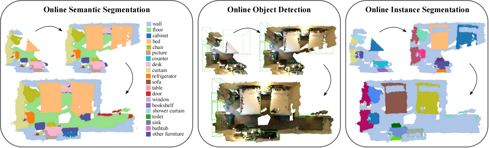
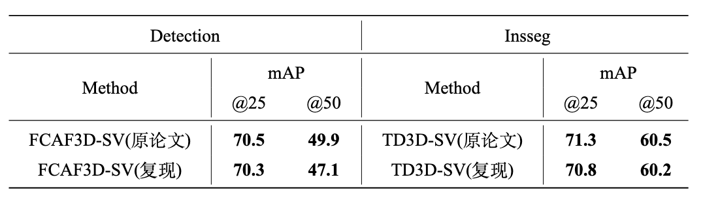

# Memory-based Adapters for Online 3D Scene Perception

## Introduction

这个仓库包含了基于 [MMDetection3D](https://github.com/open-mmlab/mmdetection3d)的 [Memory-based Adapters for Online 3D Scene Perception](https://arxiv.org/abs/2403.06974) pytorch实现. 原论文的 [中文解读](https://zhuanlan.zhihu.com/p/704435537)可通过链接访问。

> Memory-based Adapters for Online 3D Scene Perception  
> [Xiuwei Xu](https://xuxw98.github.io/)*, Chong Xia\*, [Ziwei Wang](https://ziweiwangthu.github.io/), [Linqing Zhao](https://scholar.google.com/citations?user=ypxt5UEAAAAJ&hl=zh-CN&oi=ao), [Yueqi Duan](https://duanyueqi.github.io/), [Jie Zhou](https://scholar.google.com/citations?user=6a79aPwAAAAJ&hl=en&authuser=1), [Jiwen Lu](http://ivg.au.tsinghua.edu.cn/Jiwen_Lu/)
>



原论文提出了一种模型与任务无关的即插即用模块，可将离线的3D场景感知模型（以重建的点云作为输入）转换为在线感知模型（以流式RGB-D视频作为输入）。

## Method

整个方法流程见下图:


基于内存的适配器可以通过在配置文件中添加几行代码轻松插入到现有架构中：
```python
model = dict(
    type='SingleViewModel',
    img_memory=dict(type='MultilevelImgMemory', ...),
    memory=dict(type='MultilevelMemory', ...),
    ...)
```

## Getting Started
数据预处理和环境配置按照以下教程:
- [Installation](docs/install.md) 
- [Prepare Dataset](docs/data.md)

训练，评估和微调
- [Train, Evaluation and Visualization](docs/run.md)


## Main Results
以下是原项目结果：

3D semantic segmentation on ScanNet and SceneNN:

 Method | Type | Dataset | mIou | mAcc | Downloads 
 | :--------------: | :----: | :----: | :----: |:----: |:----: |
 MkNet | Offline | ScanNet |71.6 | 80.4 | -
 MkNet-SV | Online | ScanNet |68.8 | 77.7 | [model](https://cloud.tsinghua.edu.cn/f/fada43a9f0c14e79ac30/?dl=1)
 MkNet-SV + Ours | Online | ScanNet |72.7 | 84.1 | [model](https://cloud.tsinghua.edu.cn/f/5a73056b11a346d5a0ad/?dl=1)
 MkNet-SV | Online | SceneNN |48.4 | 61.2 | [model](https://cloud.tsinghua.edu.cn/f/fada43a9f0c14e79ac30/?dl=1)
 MkNet-SV + Ours | Online | SceneNN |56.7 | 70.1 | [model](https://cloud.tsinghua.edu.cn/f/5a73056b11a346d5a0ad/?dl=1)

3D object detection on ScanNet:
 Method | Type |  mAP@25 | mAP@50 | Downloads 
 | :--------------: |  :----: | :----: |:----: |:----: |
 FCAF3D | Offline | 70.7 | 56.0 | -
 FCAF3D-SV | Online | 41.9 | 20.6 | [model](https://cloud.tsinghua.edu.cn/f/d87c8f18f9c3490b983d/?dl=1)
 FCAF3D-SV + Ours | Online |70.5 | 49.9 | [model](https://cloud.tsinghua.edu.cn/f/9a7444e183a64abaae00/?dl=1)

 3D instance segmentation on ScanNet:
 Method | Type |  mAP@25 | mAP@50 | Downloads 
 | :--------------: | :----: | :----: |:----: |:----: |
 TD3D | Offline |81.3 | 71.1 | -
 TD3D-SV | Online|53.7 | 36.8 | [model](https://cloud.tsinghua.edu.cn/f/aa7155bbc58840a697bb/?dl=1)
 TD3D-SV + Ours | Online | 71.3 | 60.5 | [model](https://cloud.tsinghua.edu.cn/f/438ebd22f9524d2daade/?dl=1)

<!--
 Here is the performance of different 3D scene perception methods on ScanNet online benchmark. We report mIoU / mAcc, mAP@25 /
mAP@50 and mAP@25 / mAP@50 for semantic segmentation, object detection and instance segmentation respectively.
And NS means the number of sequence, while LS means the length of Sequence.

 Task | Method | Type | NS 1 | NS 5 | NS 10| LS 5 | LS 10 | LS 15 
 | :----: | :----: | :----: | :----: |:----: |:----: |:----: |:----: |:----: |
 Semseg | MkNet | Offline | 63.7/73.5 | 62.7/72.8 | 58.9/69.4|59.3/69.8|63.0/73.0|63.5/73.7
 Semseg | MkNet-SV | Online | 63.3/74.3 | 63.3/74.3 | 63.3/74.3 |63.3/74.3 |63.3/74.3 |63.3/74.3 
  Semseg | MkNet-SV + Ours | Online | 69.1/82.2 | 66.8/80.0 | 65.9/79.2|65.9/79.3|66.8/80.1|67.1/80.4
 Detection | FCAF3D | Offline | 57.0/40.6 | 41.1/25.2 | 34.6/19.3|28.4/15.2|33.9/19.4|37.7/22.8
 Detection | FCAF3D-SV | Online | 41.9/20.6 | 29.8/13.3 | 27.0/11.5|24.4/10.1|26.2/11.0|27.6/12.1
 Detection | FCAF3D-SV + Ours | Online | 70.5/49.9 | 58.7/37.7 | 56.2/34.3|53.1/31.2|54.9/33.8|56.1/35.6
 Insseg | TD3D | Offline | 64.0/50.8 | 61.6/49.7 | 59.4/48.4|59.0/47.9|61.4/49.8|61.7/49.8
 Insseg | TD3D-SV | Online | 53.7/36.8 | 54.2/41.6 | 57.0/46.3|56.4/45.5|53.9/40.9|52.6/39.5
 Insseg | TD3D-SV + Ours  | Online | 71.3/60.5 | 64.7/55.2 | 64.2/55.0|64.0/54.7|64.6/55.1|63.9/54.3
-->


Visualization results:


## Reproduce

下表是3D语义分割结果比较：

下表是3D目标检测和实例分割结果比较:

## Tips

如果你的 GPU 资源有限，可以考虑以下措施：

- 移除 2D 模态（img_memory 或整个 img_backbone）。需要注意的是，在我们的 3D 实例分割实验中，我们移除了 img_memory 来避免出现 OOM（显存不足）的情况。

- 仅在高层主干网络特征之后插入适配器。我们观察到，特征层级越高，适配器的性能越好，同时分辨率越低，计算量也越小。例如，可以更改如下内容：

```python
img_memory=dict(type='MultilevelImgMemory', ada_layer=(0,1,2,3))
memory=dict(type='MultilevelMemory', vmp_layer=(0,1,2,3)),
```
&nbsp;&nbsp;&nbsp;&nbsp;&nbsp;&nbsp;&nbsp;&nbsp;To:
```python
img_memory=dict(type='MultilevelImgMemory', ada_layer=(2,3))
memory=dict(type='MultilevelMemory', vmp_layer=(2,3)),
```
&nbsp;&nbsp;&nbsp;&nbsp;&nbsp;&nbsp;&nbsp;然后，图像和点云适配器将仅插入到最高两个特征层级之后（针对四层主干网络）。


## Bibtex
If this work is helpful for your research, please consider citing the following BibTeX entry.

```
@article{xu2024online, 
      title={Memory-based Adapters for Online 3D Scene Perception}, 
      author={Xiuwei Xu and Chong Xia and Ziwei Wang and Linqing Zhao and Yueqi Duan and Jie Zhou and Jiwen Lu},
      journal={arXiv preprint arXiv:2403.06974},
      year={2024}
}
```
